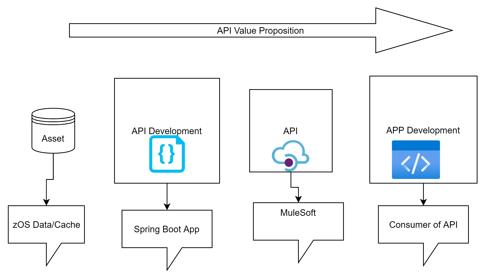
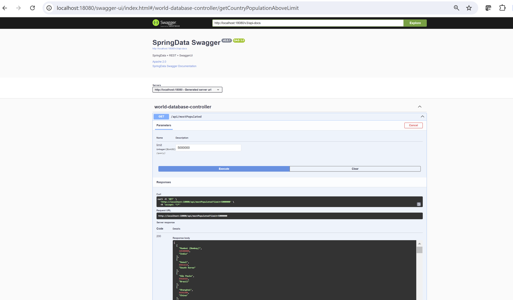
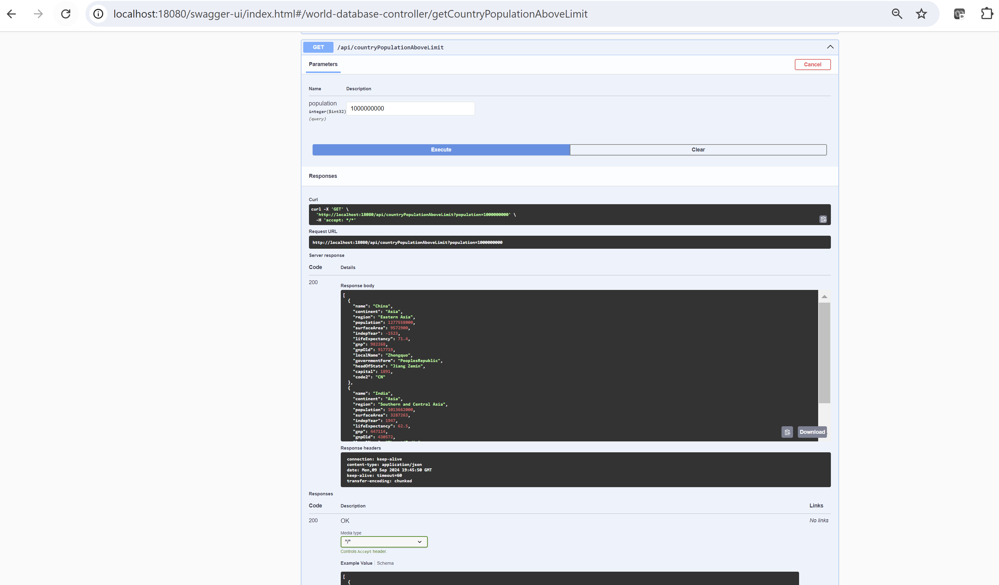

# Design
- How to best expose the GG Cache data as REST endpoints and preferably as API with Swagger documentation & specification? 
- This requirement originated from MuleSoft as that is how they integrate with API endpoints for their API management software.
- The above prompted me to think that we can push towards the following API Value Proposition with our customers. 
- In the diagram below I am showing the Asset as zOS Data/Cache but really it can be any "Asset" that a company may want to expose via API Management tool for additional revenue stream and how to make this happen quickly.

- With the magic of Maven, Spring and  Springfoxswagger/UI we enhanced the Spring Data Training app ("World Database'') to generate Swagger API Docs and specifications.

